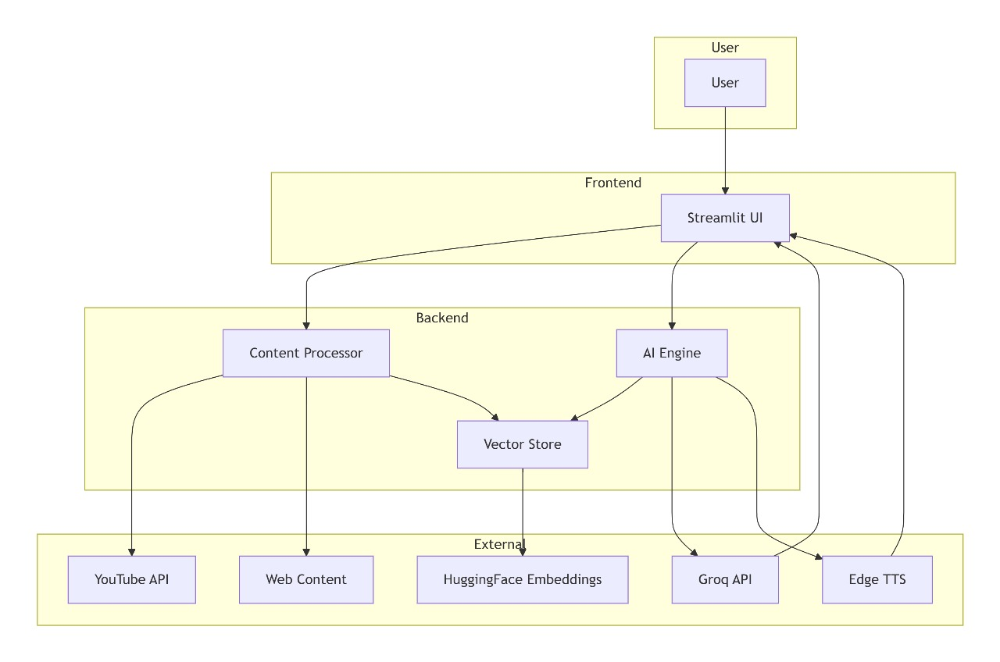

# 🤖 Intellexa - AI Content Analysis Assistant

<p align="center">
  <em>Chat with YouTube videos, research papers, news articles, and web content like never before!</em>
</p>

<p align="center">
  
  
  
  
</p>

## 🎯 What is Intellexa?

Intellexa is an advanced AI assistant that lets you have meaningful conversations with various content types. Simply provide a YouTube URL or web content link, and instantly chat with the content using our enhanced RAG pipeline with LangGraph memory.

### 🌟 Why Choose Intellexa?

| Feature | Advantage |
|---------|-----------|
| **🎥 YouTube Video Analysis** | Extract transcripts and chat with any YouTube video content |
| **📚 Multi-Format Support** | Process PDFs, research papers, news articles, blogs, and webpages |
| **🧠 Smart Content Routing** | AI-powered decision making for optimal response generation |
| **🎵 Voice Interaction** | Speak your queries and get audio responses |
| **💬 Context-Aware Memory** | Remembers conversation history across interactions |
| **⚡ Real-Time Processing** | Instant responses with Groq's high-speed LLMs |

## 🏗 System Architecture



### High-Level Workflow:
1. **Content Input** → User provides YouTube URL or web content link
2. **Processing Engine** → Extracts and processes content based on type
3. **AI Intelligence** → LangGraph-powered routing and memory management
4. **Response Generation** → Context-aware answers with optional audio
5. **User Interaction** → Clean Streamlit interface with voice support

## 🚀 Quick Start

### Prerequisites: Python 3.9+ & [Groq API Key](https://console.groq.com/keys)

```bash
# 1. Clone and setup
git clone https://github.com/sapana27/Intellexa-Content_Analysis_AI.git
cd Intellexa-Content_Analysis_AI

# 2. Create virtual environment
python -m venv venv
venv\Scripts\activate  # Windows
# source venv/bin/activate  # Linux/macOS

# 3. Install dependencies
pip install -r requirements.txt

# 4. Configure environment
echo "GROQ_API_KEY=your_groq_api_key_here" > .env

# 5. Launch application
streamlit run frontend.py
```

The application will open at `http://localhost:8501`

## 📹 Demo Video


*Watch Intellexa in action: Processing YouTube videos, analyzing research papers, and providing intelligent responses with audio support.*

## 💡 Key Advantages

### 🎯 Content Versatility
- **YouTube Videos**: Automatic transcript extraction and timestamp-based analysis
- **Research Papers**: ArXiv integration with structured metadata extraction
- **PDF Documents**: Text extraction with page-level context
- **News Articles**: Intelligent scraping with author and date information
- **Web Content**: Advanced processing for blogs and general webpages

### 🧠 Advanced AI Capabilities
- **Enhanced RAG Pipeline**: Goes beyond basic retrieval with contextual understanding
- **LangGraph Memory**: Maintains conversation context across multiple interactions
- **Intelligent Routing**: Automatically detects query type and routes to appropriate handler
- **Multi-Modal Interaction**: Text and voice input with audio response generation

### ⚡ Performance & User Experience
- **High-Speed Processing**: Leverages Groq's lightning-fast inference
- **Real-Time Responses**: Minimal latency for seamless conversations
- **Voice Integration**: Speak naturally and get spoken responses
- **Clean Interface**: Intuitive Streamlit UI with modern design

## 🛠 Usage Guide

### 1. Load Content
- **YouTube**: Paste URL in sidebar → Select language → Click "Load YouTube Video"
- **Web Content**: Paste PDF/article URL → Click "Load Web Content"

### 2. Ask Questions
- **Type** in chat input or **click microphone** for voice
- Ask about content, summaries, specific sections, or general queries

### 3. Get Responses
- Read AI responses with context from your content
- Toggle audio playback in sidebar for voice responses

## 🔧 Technical Stack

| Component | Technology |
|-----------|------------|
| **Frontend** | Streamlit |
| **AI Framework** | LangChain, LangGraph |
| **LLM** | Groq (Llama-3.3-70b) |
| **Embeddings** | HuggingFace Sentence Transformers |
| **Vector Store** | ChromaDB |
| **Content Processing** | YouTube Transcript API, BeautifulSoup, Newspaper3k |
| **Audio** | Edge TTS, Streamlit Mic Recorder |

## 🤝 Contributing

We welcome contributions! Please feel free to submit pull requests, report bugs, or suggest new features.

## 📄 License

This project is licensed under the MIT License - see the LICENSE file for details.

---

<p align="center">
  <strong>Ready to transform how you interact with content? Start chatting with Intellexa today! 🚀</strong>
</p>

<p align="center">
  <em>For questions or support, please open an issue or contact the development team.</em>
</p>